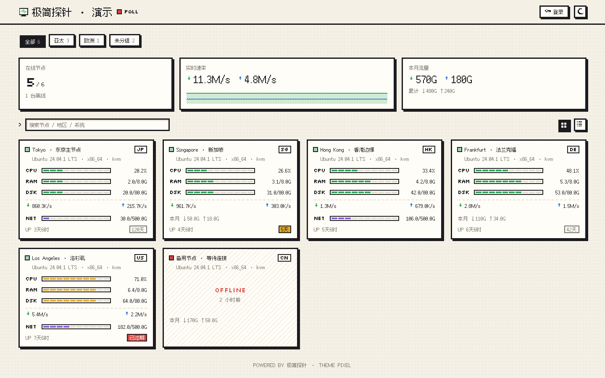

# Pixel for 极简探针



为 [极简探针 Monitor](https://github.com/monitor-probe/monitor) 制作的 8-bit 复古像素风主题：黑框硬阴影、方块进度条、阶梯折线图与像素字体，亮 / 暗两套配色。

## 功能

- **首页**：在线数、实时速率（带 2 分钟像素迷你图）、本月 / 累计流量概览；原生分组标签；搜索；卡片 / 列表两种布局；离线节点置底。
- **节点卡片**：CPU / 内存 / 磁盘方块条、实时上下行、流量配额、在线时长、到期天数（使用 Hub 下发的 `expires_in`），可选显示价格。
- **节点详情** `/node/{id}`：实时负载、系统信息、1H / 6H / 24H / 7D 历史图（CPU、内存、网络、磁盘、多线路 Ping 与丢包），canvas 逐像素绘制，悬停显示读数。
- **实时数据**：优先使用 `/api/ws` 推送，断开时自动退回 5 秒轮询并重连。
- **字体**：Silkscreen（英文标题）+ 缝合像素字体 Fusion Pixel 12px（中文），均随主题包分发，不请求第三方服务。

## 站点设置

后台「主题」卡片中可修改，对所有访客生效：

| 设置 | 说明 |
| --- | --- |
| 默认配色 | 跟随系统 / 亮色 / 暗色；访客手动切换后以访客为准 |
| 默认布局 | 卡片或列表 |
| 中文像素字体 | 关闭后中文使用系统字体，并不再加载约 600 KB 的字体文件 |
| 公告 | 首页顶部纯文本公告 |
| 显示概览 / 显示价格 / 隐藏离线节点 | 首页显示开关 |
| 默认时间范围 | 详情页历史图默认范围 |

## 安装

在极简探针后台「主题」→「上传主题包」，选择 [Releases](https://github.com/Gongsc/Theme-Pixel/releases) 中的 `theme.tar.gz` 并启用。

## 开发

需要 Node.js 22.12+：

```sh
npm ci
npm run dev       # 开发服务器，/api 代理到 127.0.0.1:9911
npm run build     # 类型检查并构建
npm run package   # 生成 release/theme.tar.gz
```

设置 `MONITOR_HUB=https://hub.example.com` 可代理到已开启公开状态页的现成 Hub。没有 Hub 时运行 `python3 scripts/demo-server.py` 提供演示数据（`PORT=9922` 可换端口，同时设置 `MONITOR_HUB=http://127.0.0.1:9922`）。

发布新版本：把 `theme.json`、`package.json`、`package-lock.json` 中的版本号改为同一版本，推送 `x.y.z` 格式的 tag，GitHub Actions 会构建并创建带 `theme.tar.gz` 的 Release。

## 许可

MIT。Silkscreen 与 Fusion Pixel 字体均使用 SIL Open Font License 1.1。
