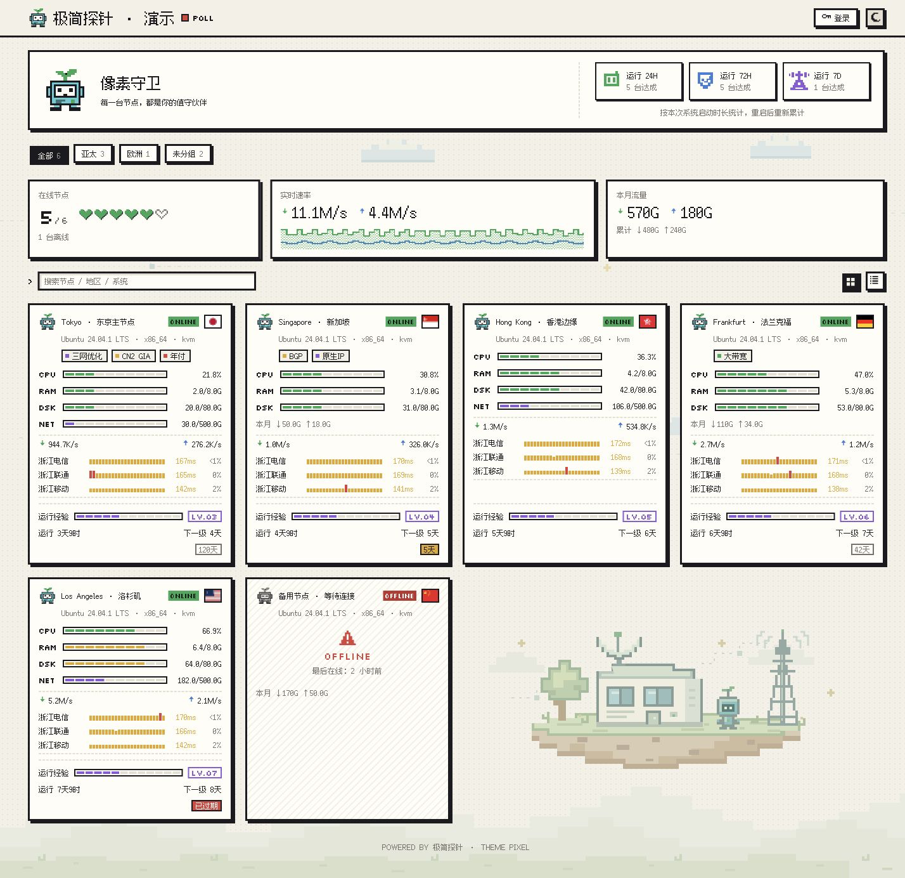
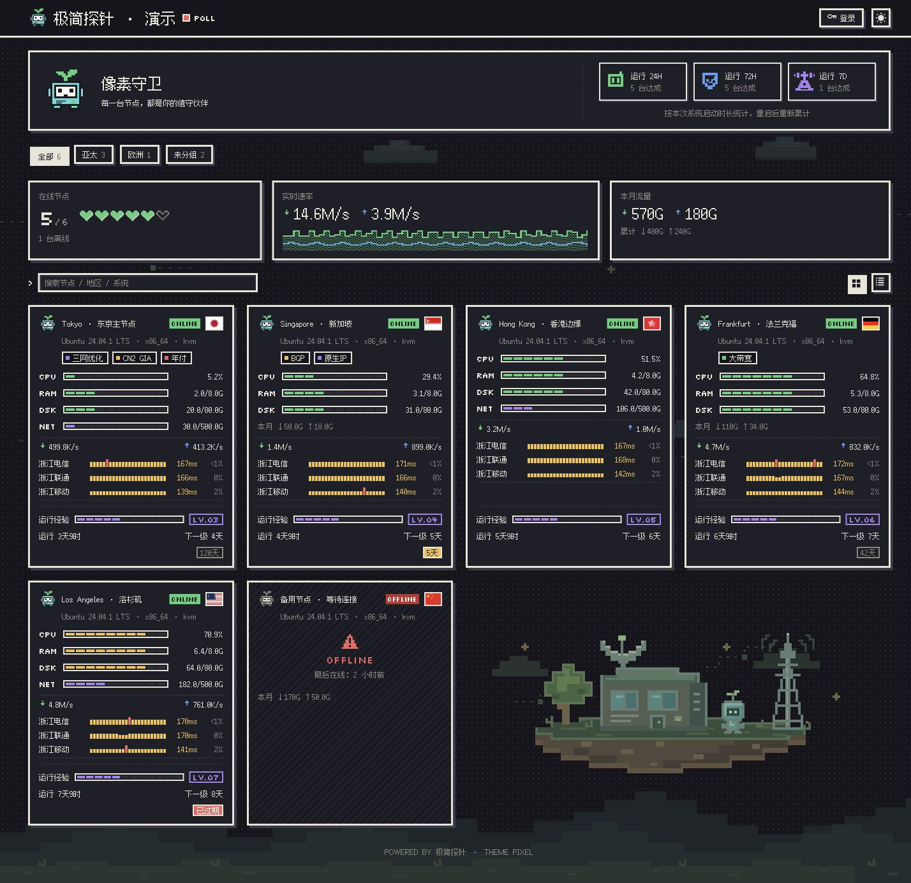

# Pixel for 极简探针





为 [极简探针 Monitor](https://github.com/monitor-probe/monitor) 制作的 8-bit 复古像素风主题：黑框硬阴影、方块进度条、阶梯折线图与像素字体，亮 / 暗两套配色。

## 功能

- **首页**：在线数、实时速率（带 2 分钟像素迷你图）、本月 / 累计流量概览；原生分组标签；搜索；卡片 / 列表两种布局；离线节点置底。
- **节点卡片**：右上角像素国旗；CPU / 内存 / 磁盘 / 流量配额方块条、实时上下行、在线时长、到期天数（使用 Hub 下发的 `expires_in`），可选显示价格。
- **备注标签**：节点的公开备注（Hub 1.3.2 起的 `public_remark`）按 `;` 或 `；` 拆分为多个标签，显示在卡片与详情页，所有访客可见；同名标签颜色固定。旧版 Hub 没有公开备注，退回读取只下发给已登录管理员的私有备注。
- **节点延迟**：卡片显示前几条探测线路的最新延迟、近 24 次采样的像素柱状条（绿 <100ms、黄 <200ms、红 ≥200ms 或超时）与 1 小时丢包率；列表视图增加 PING 列。
- **节点详情** `/node/{id}`：实时负载（CPU / 内存 / 交换 / 磁盘 / 流量配额 / 速率）、系统信息、历史图（CPU、内存、网络、磁盘、多线路 Ping 与丢包），canvas 逐像素绘制，悬停显示读数。时间范围按 Hub 的保留天数生成（1H / 6H / 24H / 7D / 30D / 90D / 全部）；CPU 与网速另以淡色画出区间峰值。
- **实时数据**：优先使用 `/api/ws` 推送，断开时自动退回 5 秒轮询并重连。
- **原创游戏元素**：像素守卫、在线节点爱心、运行经验条与 24H / 72H / 7D 成就；等级按本次系统运行的完整天数计算，每 24 小时升一级，重启后重新累计。成就只统计当前分组内在线且已上报指标的节点，不表示历史可用率。
- **像素世界背景**：淡色云朵、数据包线路与底部地形，宽屏节点网格的剩余空间展示原创机房浮岛；亮暗配色均适配，装饰不遮挡数据或响应点击。
- **字体**：Silkscreen（英文标题）+ 缝合像素字体 Fusion Pixel 12px（中文），均随主题包分发，不请求第三方服务。

## 1.3.0 更新内容

- 新增原创像素守卫与在线节点爱心，站点图标同步改为守卫。
- 新增运行经验条、等级与 24H / 72H / 7D 成就，按本次系统启动后的运行时长统计，重启后重新累计。
- 新增像素云朵、数据包线路、底部地形与宽屏机房浮岛；修复暗色模式下背景插画仍使用亮色的问题。
- 更新亮色与暗色首页预览图。

## 适配极简探针 1.3.2

- 时间范围按 `/api/me` 的 `history_days` 生成，超过 7 天的窗口读 Hub 的小时汇总，并在范围按钮旁注明每点覆盖的时长；旧版 Hub 没有该字段时按 7 天。
- CPU 图画出 `cpu_max`，网速图画出 `net_rx_max` / `net_tx_max`（Hub 1.3.1+），以淡色显示在均值后方，悬停同时显示均值与峰值；Hub 不提供时不画。
- 备注标签改读公开备注 `public_remark`，普通访客也能看到。
- 价格按 Hub 的中文写法显示（如 `US$5.00 · 月付`、`NT$12.50 · 18 个月付`），支持任意三字母货币与 `<n>m` 付款周期；旧版 Hub 存下的非法货币代码不再导致报错。
- 跨多天的坐标轴只显示日期。

## 1.1.0 更新内容

- 卡片国家代码改为像素国旗（12×9 栅格化），无对应国旗时仍显示代码。
- 节点备注以标签形式展示，支持用分号分隔多个标签。
- 卡片中流量配额条移到磁盘下方；详情页新增同样的流量配额条，原速率行改名为 SPD。
- 站点图标与顶栏 Logo 换为像素小鸡。

## 站点设置

后台「主题」卡片中可修改，对所有访客生效：

| 设置 | 说明 |
| --- | --- |
| 默认配色 | 跟随系统 / 亮色 / 暗色；访客手动切换后以访客为准 |
| 默认布局 | 卡片或列表 |
| 中文像素字体 | 关闭后中文使用系统字体，并不再加载约 600 KB 的字体文件 |
| 公告 | 首页顶部纯文本公告 |
| 显示概览 / 显示价格 / 隐藏离线节点 | 首页显示开关 |
| 显示延迟 | 每分钟为每个在线节点请求一次近 1 小时延迟记录（最多 4 个并发，标签页隐藏时暂停） |
| 卡片延迟线路数 | 未指定线路时，每张卡片与列表显示的前几条线路，1–6，默认 3 |
| 显示的延迟线路 | 线路名称，用逗号（`,` 或 `，`）隔开，按填写顺序显示，如 `浙江电信,浙江联通,浙江移动`；不区分大小写，节点没有的线路会跳过；留空则显示前几条 |
| 默认时间范围 | 详情页历史图默认范围 |

## 安装

在极简探针后台「主题」→「上传主题包」，选择 [Releases](https://github.com/Gongsc/Theme-Pixel/releases) 中的 `theme.tar.gz` 并启用。Hub 1.3.2 起也可以直接填写仓库地址 `https://github.com/Gongsc/Theme-Pixel` 安装。

## 开发

需要 Node.js 22.12+：

```sh
npm ci
npm run dev       # 开发服务器，/api 代理到 127.0.0.1:9911
npm run build     # 类型检查并构建
npm run package   # 生成 release/theme.tar.gz
```

设置 `MONITOR_HUB=https://hub.example.com` 可代理到已开启公开状态页的现成 Hub。没有 Hub 时运行 `python3 scripts/demo-server.py` 提供按 Hub 1.3.2 行为模拟的演示数据（`PORT=9922` 可换端口，同时设置 `MONITOR_HUB=http://127.0.0.1:9922`）。

发布新版本：把 `theme.json`、`package.json`、`package-lock.json` 中的版本号改为同一版本，推送 `x.y.z` 格式的 tag，GitHub Actions 会构建并创建带 `theme.tar.gz` 的 Release。

## 许可

MIT。Silkscreen 与 Fusion Pixel 字体均使用 SIL Open Font License 1.1；国旗来自 [flag-icons](https://github.com/lipis/flag-icons)（MIT）。当前站点图标、像素守卫、成就与背景插画均为项目内原创 SVG。
